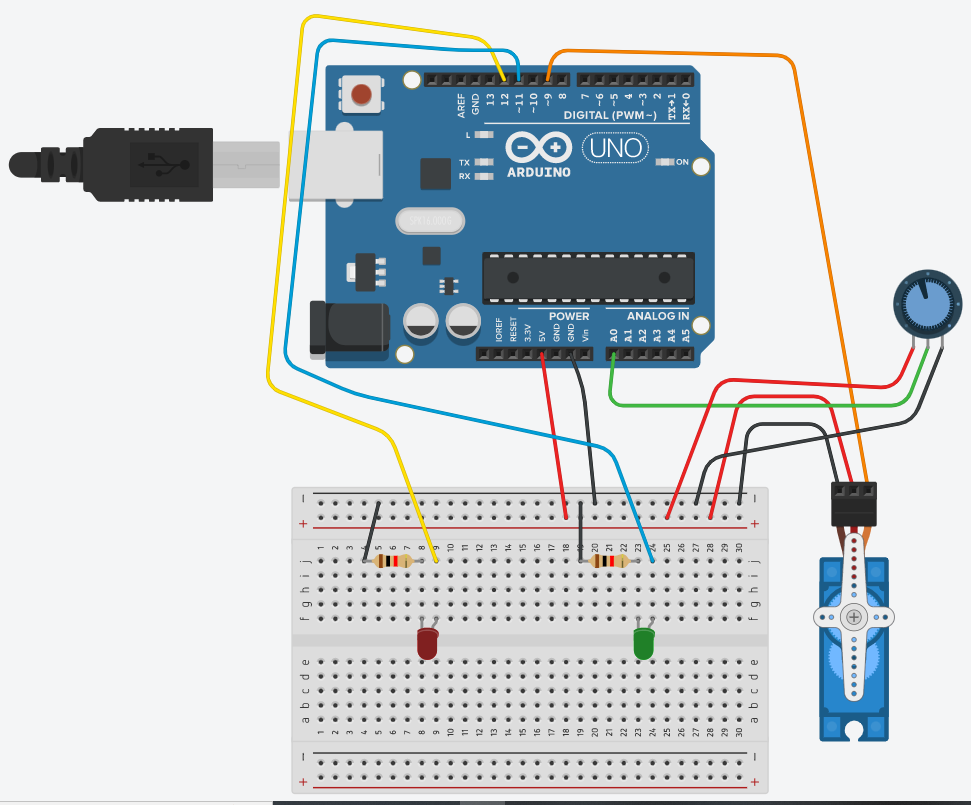

## What we want to build?
The project what we want to build is a YOLOv8 model that can detect objects such as box and pallet (miniature) from two angles at the same time and integrate it with locally IoT using Arduino UNO modules using plug-in USB for a thesis project.

# Products
- 2 EYESEC Webcams
- 1 Arduino UNO R3 ATmega328p SMD Type C
- 1 DC Servo Motor SG90
- 40p Dupont Breadboard pin jumper Male-to-Female (10cm)
- 40p Dupont Breadboard pin jumper Male-to-Male (10cm)
- 65p Bundle Breadboard pin jumper Male-to-Male (12cm, 16cm, 20cm, 24cm)
- 20p Dupont Breadboard pin jumper Male-to-Male (20cm)
- 1 MB-102 400 hole white breadboard
- LED Green and Red (10pcs each)
- Miniature wood pallet 10x10 cm
- 10 Resistor 220 Ohm
- 5 Electrolytic Capacitor 1000uF/16V
- Miniature box 1/12

# Business Logic
Two sided webcams in corners diagonally will detect boxes in front-side and back-side using tag ID, so the model wouldn't detect and count the same box twice (redundant), User will input the expectation quantity when running the application because it was a demo and the application compares if the detected boxes quantities are equal than the expected or not. if it is, then the gate would open and the green LED will lights up with delay, but if it isn't, then the gate wont opened, red LED will lights up with delay and the screen says that the quantity is not match.

# Datasets
We're using datasets with miniature of boxes and pallet with Roboflow to make the labeled dataset .yaml, this will be the thing for the model to train, we're gonna need mAP, Precision, Recall, Accurracy after each training and tuning (Make sure this can run in Google Colab). Roboflow will work with the image pre-processing for training such as brightness, noise, blurrish, and rotates. Train (80%), Validation (10%), and Test (10%)

# IoT Illustration (Without Correct if wrong)

# Machine
Macbook Air M1 2020
- Apple Silicon M1
- 8 GB RAM
- 256 GB Memory

# Arduino Map
Red LED PIN 12
Green LED PIN 13
Servo PIN 9

Red and Green LED supported with 220 Ohm